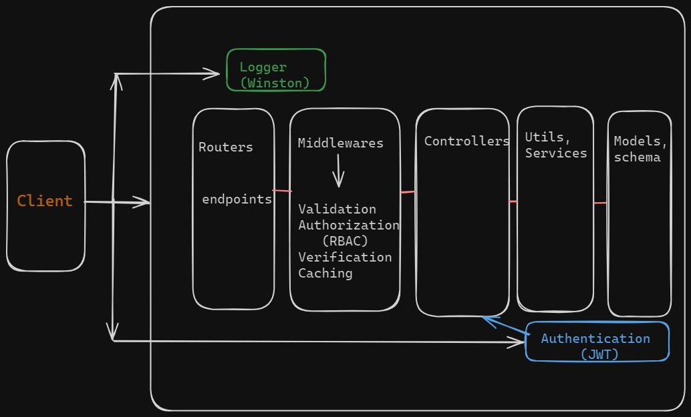

# Life-care
The Life care is a comprehensive and responsive web application designed to provide users with easy access to book an appointment with doctors 

## Tech:
- Node.js : Typescript and ExpressJs
- PostgeSQL : prisma
- Redis
- Docker

## Server Architecture


## Database
- The server use PostgreSQL with Prisma as an ORM

## OverView
### User
- life care server allows users to perform some operations like Register a new account ,login and logout where they can later create an an appointment , recive notifications and interact with doctors

### Doctor
- same operations like normal user but get appointments and then accept or delete and reset password after added by admin

### Admin
- allows admin role to perform CRUD operations with built-in accout already in db
- manage the whole web app, get all data and make a doctor accout 

### Authentication and Authorization
#### Authentication
- Users are authenticated using JWTs, cookies where a token is created when a user Register and login with valid credentials. Passwords are also encrypted using Bcrypt.
- Why use cookies ? cause HTTP is stateless we use cookies to keep track of requests, client store this cookie which allow subsequent requests made to the server to exchange the cookie for information/ resource
- a web cookie here contain JWT

#### Authorization  
- Authorization is managed using a middleware with Role Based Access Control (RBAC) system

### Validation
- there is only validation for email until now later i'll implement validation middleware using Zod

### Caching
- Redis is used as a caching middleware for the GET endpoinst. The middleware defines the Redis key using the URL of the route, then the middleware returns the cached data if available, otherwise, the request proceeds to the controller, where the key passed from the middleware gets assigned to a value.

### Server Secuirty
- done with helmet, helmet helps secure Express apps by setting HTTP response headers.

### Request Rate Limiting
- Express-rate-limiter is used as a rate-limiting middleware for all endpoints. The middleware creates a timeout after sending 100 requests from the same IP address during a 5-minute window.

### Logging
- All requests can be logged using Winston in log folder with the name of request with data and status of response 

### Documentation
- All APIs are documented using Swagger, located at the `/api-docs` endpoint.
- Thunder client collection also provided [here](./src/docs/thunder-collection_Life-care.json)

### Docker
- The application can run under development mode using Nodemon with Docker. The docker-compose contains all services used, including PostgreSQL, Redis and of course Node.js
- the Docker commands provided [here](./DockerReadme.md)

### wish list
- here i will include some features in future like Test with jest or mocha and kubernates  


### to start the application
```npm install```  
```npm run dev```


